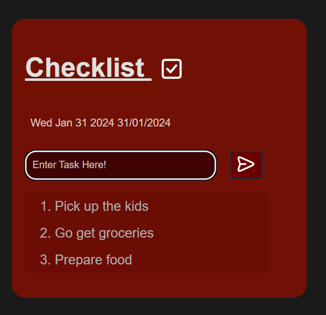
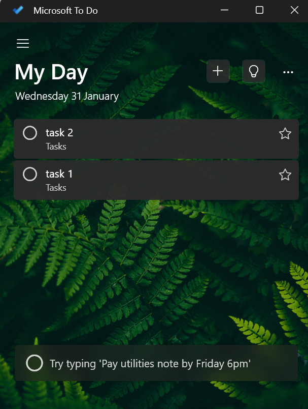
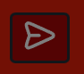

# My Second Project - Checklist
---

[CLICK HERE to View My Github Project on 'Pages'](https://armandoh4.github.io/checkpoint-taskmanager/)

---
## Introduction

'Checkpoint' is a checklist web-app which allows users to create "list items," representing their real world goals and tasks. The purpose of this app is to allow the user to keep track of their active tasks in real time. The app is simple, it allows the user to create their own unique tasks, checking them off once completed.

This is an app hosted localy and keeps track of what the user inputs onto the local host. The app sports a minimalistic design, with a red colour theme. In this project I was aiming for good function and providing good utility for the user.

---
## CONTENTS:
---
* [User Experience - UX](#user-experience) 
    * [First Time Visitor GOAL](#first-time-visitor-goal)
    * [Return Visitor GOAL](#returning-visitor-goal)

* [Design](#design)
    * [Wireframing](#wireframing)
    * [Colour Scheme and Styling](#colour-scheme-and-styling) 
    * [Typography](#typography)
    * [Features](#features)

* [Features](#features)
    * [Future Implementations](#future-implementations)

* [TESTING](#testing)

* [BUGS](#bugs)
* [Acknowledgments](#acknowledgments)
---
## User Experience:
---
### First Time Visitor GOAL

     1 - To create and delete tasks, keeping track of their todolist
     2 - Users who suffer from memory loss, or ADHD may be more inclined to use such checklists. This tool would rovide them a method to free up thinking space, without creating mental or physical clutter (planning sheets)
     3 -

### Returning Visitor Goal
In this project I will be creating an Todo-list app.

    1 - Repeat users may find other uses for this app, such as using it like a grocery list

---
## Design:

### Wireframing
            
### Colour Scheme and Styling

Similar to my previous project 'Filmlab,' I have taken inspiration from Netflix's red and grey design. Since I prefer working in dark mode, being less strenuous on the eyes. I believe that many users would feel the same, opting for dark mode/ themes more often than may have been the case 10 years ago.

 

I have also taken small inspiration from microsoft's 'todolist' app. However, microsoft incorperates many more features that I will not be emulating in my own code. This is because of the lack of resources on my end; but I hope to change that in the future and future releases after this project has been submitted.  

### Typography:
For typography, I used a light grey font colour providing a more delicate and comfortable reading experience.

I used google fonts' "Quicksand" to further improve readability, as its roundness makes it easier to on the eyes, straining them less.

I have also made the very concerted effort to keep this aplication very minimalistic to ensure that the end product is simple to use from bootup. I have used icons to also indecate te features of the program, for increased simplicity of the user experience.

))

---
## Features:

1) The User will be able to create tasks by pressing a '+' button. This action will cause a test box to appear.

2) Using the new box, the user will be able to describe the contents of the task

3) Once done, there will be another option '✓' to upload the task to the page.

4) When a task is present, there will be a method which allows the user to check off the task as 'completed'

5) Once the item has been checked off they will have a line go through it and the item may be removed from the list shortly after.

### Future Implementations:

In this project I was able to push the myself and my understanding of Javascript. However, I was not able to add features that I infact had hoped to implement. This included the ability to track tasks trough a point system. Each point would be granted to the used after the completion of a task, encouraging the user to complete more.

I also wanted to add a timer function, which would penalise the user for taking too long to complete a task. This would take the effect of taking from the users 'health points.' I also would like to animate some functions using the timer function. This idea was inspired by the app 'Habitica' - a gamified mobile checklist application.

While I was not able to find the time to accomplish this yet, as I am still coming to grips with what I can do with this language. I hope to be able to really push the limits of this app in the future.

---
## Testing:
[Testing found here](TESTING.md)

## Bugs:

So far I have had a bug appear in the last few days before release, where my numeration of task stored in the 'float' element only works on some devices. It however does not show any bugs and only became finiky after I had run my code through a debugger. This is something that I would be able to fix in the future, however as I am unable to at this time, I leave it for the few devices that still are able to utilise the feature.

##  Acknowledgments:
event.preventDefault(); -> the idea for using .prevent default came from:
https://openjavascript.info/2022/12/13/get-checked-checkbox-values-from-html-form-with-javascript/

Other inspiration came of the the design of thing like the microsoft todolist & netflix (credited in design section above).