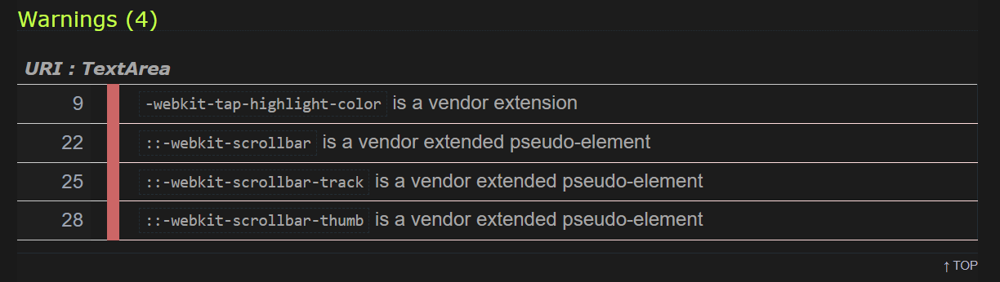

# Testing - Task Manager

---
## Contents:
  * [W3C Validator](#w3c-html-validaton)
  * [Jigsaw](#jigsaw-css-validation)
  * [Testing User Stories](#testing-user-stories)
---

## Jigsaw CSS Validation
    
| Bug (class)   | Error  | Soloution & Result |
| :------------ |:---------------| :-----|
|I had 4 warnings for 'webkit' elements (see screenshot below)|These were not necesarry elements and therefore were easily removed. This is especially true for the changes to the scrollbar, which would be unnoticable for such an aplication as this.|PASS|

After Removal of the aformentioned items:

The following 'errors' did not affect my code in any meaningful way, and by removing this code, my website would loose features. For example, code such as "-webkit-tap-highlight-color: transparent;" can have a positive effect on the webpage, such as removing the blue box when a button on a mobile is clicked, improving mobile UX.

## W3C HTML Validation

### *index.html:*

| Error | Soloution & Result | Pass or Fail |
| :-------- | :-----|:- |
|Bad value - Empty string instead of MIME type|I removed the type proprrty|PASS|
|tag body seen but an element of the same type was already open|To fix this, I removed the second "body" element|PASS|
|Saw an end tag after body had been closed.|Removed additional body element, allowing the page to render content correctly. Resolving this issue also resolved multiple other errors in the validator|PASS|
|Attribute aria-placeholder not allowed on element div at this point|Here I removed the unused aria-element to resolve the bug|PASS|

After thorough testing, all HTML Code Valid:

### *source.js:*
| Error | Soloution & Result | Pass or Fail |
| :-------- | :-----|:- |
|Line is longer than 80 characters.|I solved this issue by seperating comments in my code, making my code more readable|Pass|
|Unexpected 'for' 'for (t in task)'|By converting from a 'for ... in' loop, to a 'for ... of'. This allows for better looping ofver an array, rather than an object|PASS|
|Undeclared 't'||
|Unexpected trailing space. 'appForm.addEventListener("submit", function (event)'||
|Redefinition of 'taskItem' from line 10. 'const taskItem = document.createElement("li")'
|Unexpected trailing space|Removal of spacing at the end of '{'|PASS|
|Unexpected 'let' - ' for (let i = 0; i < taskItems.length; i++)'||
|Used single quotes in elements like 'time'|I removed single quotes from these variable names|

## Testing User Stories:

- Text Input: Pass

### First Time Visitor
| User Story |Pass or Fail |Soloution & Result |
| :---- |:-- |:-------|
|1 - ||
|2 - ||
|3 - ||

### Returning Visitor GOAL
| User Story |Pass or Fail |Soloution & Result |
| :---- |:-- |:-------|
|1 - |||
